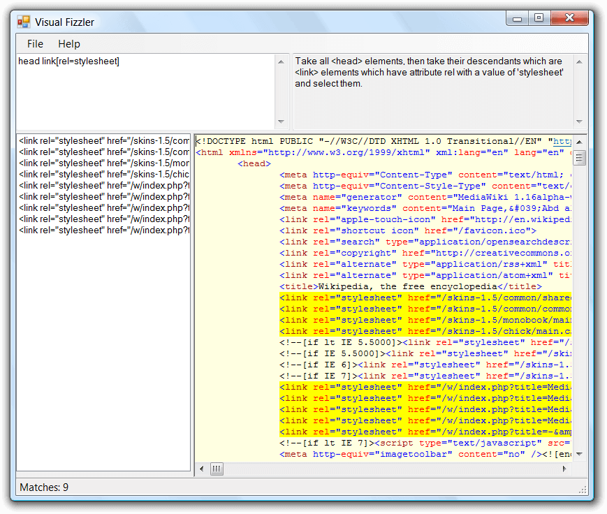

# VisualFizzler

VisualFizzler is Windows Forms application that allows testing CSS Selectors
against an HTML page loaded from disk or the Web.

It uses [Fizzler](https://github.com/atifaziz/Fizzler) as the CSS Selectors
engine and therefore supports the same set of selectors.

It requires Microsoft .NET Framework 4.0 or later to run.
